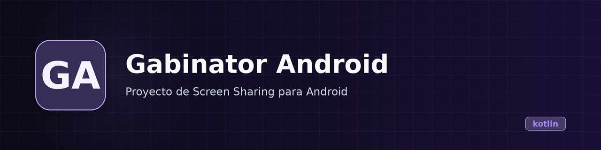

<p align="center">
  
</p>

<h1 align="center">Gabinator_Android</h1>

<p align="center"><b>Android client that receives and displays screen frames from a PC over USB Accessory protocol.</b></p>

<p align="center">
  
  
  
  
</p>

---

## What it is

A minimal Android app that connects to a PC via USB Accessory mode, receives JPEG bitmap data in a loop, and displays each frame in an `ImageView`. The companion PC-side sender (not included) must identify as the `PCHost` manufacturer, model `PCHost1`.

**In one sentence:** USB screen mirroring receiver for Android, from a specific PC sender.

## State

| | |
|---|---|
| **State** | Prototype |
| **Last activity** | 2024-04 |
| **Usable today** | No — requires a matching PC-side USB sender (`PCHost1`) that is not in this repo |
| **What's missing** | PC sender app, connection error handling, no frame rate control, global state everywhere, Firebase Crashlytics dependency with no initialization |
| **Risks / known debt** | All state is global (`var` at package level), no lifecycle management, infinite loop in receiver thread, hardcoded device filter |

## Why it exists

Academic/personal project for experimenting with Android USB Accessory communication. The git history shows iterative debugging of image transfer sizing issues (`Act` through `Act6`), typical of a learning exercise.

## Demo

No demo available. The app shows a console log and an `ImageView` that updates when frames arrive over USB.

## Installation and use

Requirements:
- Android device with USB OTG support (minSdk 21, targetSdk 34)
- Android Studio or Gradle CLI
- A PC running the companion USB sender (not included)

```bash
# Clone and build
git clone https://github.com/Gonanf/Gabinator_Android.git
cd Gabinator_Android
./gradlew assembleDebug
```

```bash
# Install on device
adb install app/build/outputs/apk/debug/app-debug.apk
```

The app launches, waits for a USB accessory connection, and starts receiving frames.

## Stack

- **Language:** Kotlin 1.9
- **UI:** XML layouts (Compose configured but unused)
- **Android SDK:** compileSdk 34, minSdk 21
- **Dependencies:** AndroidX Core KTX, Lifecycle Runtime KTX, Activity Compose, Compose BOM (unused), Firebase Crashlytics Build Tools (unused)
- **USB:** Android USB Accessory API (`android.hardware.usb`)

## Architecture

Single-activity app with no architecture pattern.

```
MainActivity
  ├── Connect() — registers BroadcastReceiver for USB events
  ├── onResume() — checks permissions, requests if missing
  ├── USB_PERMISSION receiver — opens FileDescriptor, starts receiver thread
  └── Receiver thread — reads bitmap bytes, decodes to Bitmap, updates ImageView via Handler
```

## Repo structure

```
app/
  src/main/java/chaos/gabinator/
    MainActivity.kt        # All app logic (190 lines)
    ui/theme/              # Compose theme files (unused by the app)
  src/main/res/
    layout/main_layout.xml # Console TextView + ImageView
    xml/device_filter.xml  # USB device filter (PCHost1)
build.gradle.kts           # Top-level Gradle config
app/build.gradle.kts       # App module config
gradle/libs.versions.toml  # Version catalog
```

## Roadmap

- [ ] Extract companion PC-side sender into this repo or link to it
- [ ] Replace global state with ViewModel or state holder
- [ ] Add frame rate control and connection status UI
- [ ] Handle USB disconnection gracefully
- [ ] Add error recovery for malformed frames
- [x] Basic USB accessory connection and frame reception
- [x] Debug console showing connection state

## Notes and decisions

- **Global variables:** All state (`usbManager`, `device`, `FD`, `IS`, `OS`, `bt`) is at package level. This was likely the fastest way to get it working during the learning exercise. A proper fix would move these into `MainActivity` properties or a ViewModel.
- **Firebase Crashlytics:** Dependency is included but never initialized — dead dependency.
- **Compose:** Build config enables Compose, but the app uses XML layouts (`main_layout.xml`). The Compose theme files under `ui/theme/` are auto-generated boilerplate, not used.
- **Device filter:** Hardcoded to `PCHost1` by `PCHost`. Any other USB sender won't work without changing `device_filter.xml`.
- **Receiver thread:** Runs an infinite loop reading from the USB input stream. No frame rate limiting, no timeout, no clean shutdown.

## License

Privado — no public license.

---

<!-- Template rules applied: Spanish → English, no marketing, honest state declaration, commands verified via repo inspection. -->
